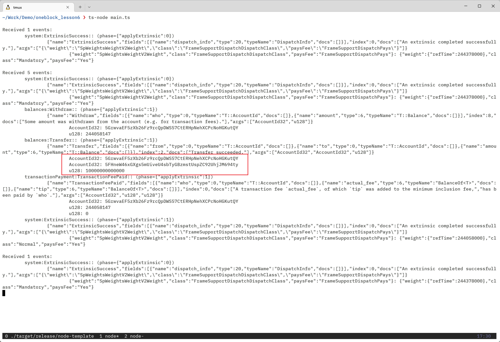

# Oneblock+ 第6课作业

使用polkadot js api来写一个订阅Event的程序

运行步骤

1. 安装依赖，并运行。

```
npm -g typescript
npm -g ts-node
yarn install
ts-node main.ts
```

2. 在 apps 上使用 Alice 账号向 Bob 账号转账 10 个 Unit。


3. 后台上观察事件输出。

